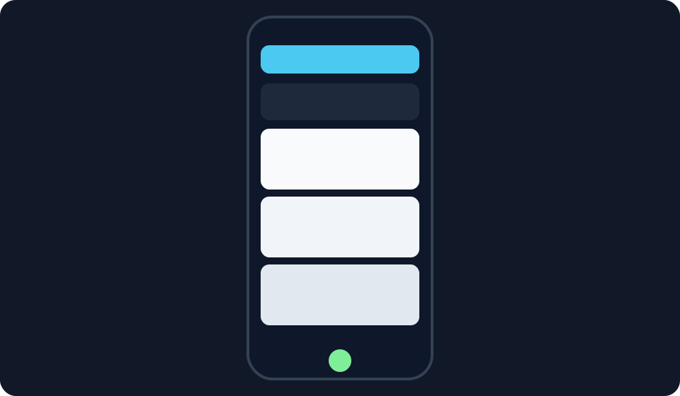

# Task-Daddy

<p align="center">
  
</p>

<p align="center"><strong>Small tasks. Big momentum.</strong></p>

Stop keeping your whole life in your head.
Task-Daddy helps you capture quick tasks, organize work, and actually finish things.

## 60-second start

```bash
git clone <YOUR_REPO_URL>
cd task-daddy
./bootstrap.sh
```

Open: `http://localhost:3005`

Get the generated login credentials:

```bash
docker compose exec api cat /app/data/backups/bootstrap_credentials.txt
```

If your compose project name is custom, this also works:

```bash
docker ps --format '{{.Names}}' | grep '_api_1$'
docker exec <api_container_name> cat /app/data/backups/bootstrap_credentials.txt
```

Then:
1. Login with the printed admin email + password.
2. Go to `Settings -> Security`.
3. Enable MFA (recommended before inviting users).

## Why people use Task-Daddy

- Fast capture when your brain is moving at 100 mph.
- Board + lane flow so work feels visual and manageable.
- AI-assisted task enhancement for clearer outcomes.
- Jira + OpenProject + webhooks when you need integrations.
- Backups, exports, notifications, reminders, ICS calendar support.

## Screenshots

<p>
  
  
</p>

## Local dev

```bash
cp .env.example .env
cp apps/api/.env.example apps/api/.env
cp apps/web/.env.example apps/web/.env
./bootstrap.sh
```

Services:
- Web: `http://localhost:3005`
- API: `http://localhost:8000`
- API docs: `http://localhost:8000/docs`

## Security baseline (before internet exposure)

Set strong values for:
- `APP_SECRET`
- `FERNET_KEY`
- `POSTGRES_PASSWORD`
- `SEED_ADMIN_PASSWORD`
- `SEED_MEMBER_PASSWORD`

Then deploy with your production compose/profile and HTTPS.

## Community vibe

Task-Daddy is for builders, students, founders, operators, creators, and anyone tired of dropped tasks.
If it helps you move faster, share your workflow and templates with the community.
