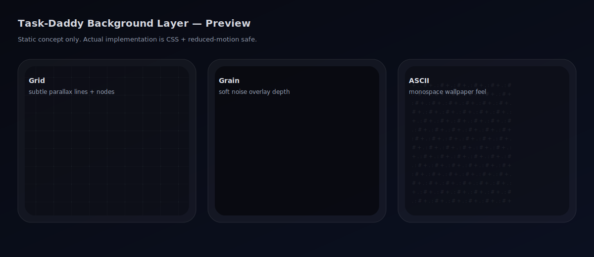

# Task-Daddy Background Layer (UX)

Task-Daddy ships a subtle animated background layer behind all content. It is designed to add depth without impacting readability or performance.

## Where to toggle

In the app:

- `Settings → Appearance → Background style`

Options:

- Off
- Grid
- Grain
- ASCII

## Accessibility

- Animation is automatically disabled when the browser has `prefers-reduced-motion: reduce`.
- The layer uses `pointer-events: none` so it never blocks clicks or drag-and-drop.

## Implementation

- Component: `apps/web/components/background-layer.tsx`
- Styles: `apps/web/app/globals.css` (`.nl-bg*`)
- Smoke check: `scripts/smoke.sh` asserts `data-testid="bg-layer"` exists on `/login`

## Preview (concept)

This is a lightweight static preview of the intended vibe (actual render is CSS-based):

